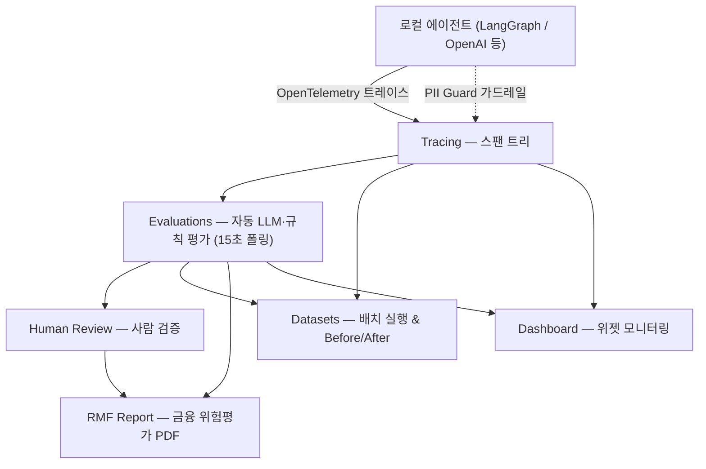
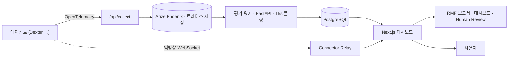

# My Own Phoenix

LLM 에이전트가 **무엇을 했는지**(추적) · **얼마나 잘했는지**(평가) · **어떻게 개선되는지**(데이터셋·사람 평가) · **규제를 지키는지**(금융 위험관리)를 한곳에서 보여주는 **LLM 관측성·평가 플랫폼**. 캡스톤으로 시작해 운영까지 올린 SaaS이며, 플랫폼 검증을 위해 자체 재무 리서치 에이전트 **Dexter**를 테스트 대상으로 올려 추적·평가한다.

**Live:** https://phoenix.rheon.kr
**Docs:** https://phoenix.rheon.kr/docs


## 전체 흐름

에이전트가 한 번 실행되면 모든 작업이 트레이스로 기록되고, 그 위에서 평가·검증·보고가 차례로 쌓인다.



## 기획 의도

- LLM 에이전트는 *모르는 것을 아는 척*(할루시네이션)하는데, **재무처럼 정확성이 생명인 도메인에선 치명적**이다. 이를 측정하고 줄일 도구가 필요했다.
- 실행 로그(트레이스)만 봐선 품질을 알 수 없어, **자동 평가(LLM-as-Judge)** 로 환각·정확도·근거성을 정량화하고자 했다.
- 금융 AI는 **규제 대응 산출물**이 필요해, 트레이스·평가를 모아 위험평가(RMF) 보고서를 자동 생성하도록 했다.
- 자동 평가도 틀리므로, **사람이 검증**하고 그 불일치로 평가 자체를 개선하는 루프를 두었다.
- 응답에 섞일 수 있는 **개인정보(PII) 유출**을 막는 가드가 필요했다.
- 로컬에서 개발 중인 에이전트를 **배포 없이** 대시보드에서 바로 대화·테스트하고 싶었다.
- 한 인스턴스에서 **여러 팀·프로젝트가 안전하게 격리**되어야 했다.

## 기술 스택

| 구분 | 사용 기술 |
|---|---|
| 프레임워크 | Next.js 16 (App Router), React 19, TypeScript, 커스텀 Node 서버(`server.ts`) |
| UI | Tailwind CSS, Radix UI, Highcharts |
| 데이터베이스 | PostgreSQL 16, Prisma 7 (24개 모델) |
| 관측성 | Arize Phoenix(트레이스 백엔드), OpenTelemetry / OpenInference (OTLP proto) |
| 평가 워커 | Python, FastAPI, arize-phoenix-evals (별도 프로세스, 15초 폴링) |
| 실시간·연결 | WebSocket(ws) 릴레이, SSE 인메모리 pub/sub |
| LLM | OpenAI · Anthropic · Google · xAI 다중 공급자 |
| 인증·보안 | Firebase Auth, AES-256-GCM, timing-safe 내부 토큰 |
| 인프라 | Docker Compose, GitHub Actions |

## 시작하기 · API 키

에이전트에 OpenInference instrumentor 한 줄 + 환경변수(`PHOENIX_API_KEY`, `PHOENIX_COLLECTOR_ENDPOINT`)만 넣으면 **2분 안에 트레이스 수집**이 시작된다(Connector 없이도 추적·평가·대시보드·PII 가드 사용 가능). 키는 스코프가 분리된 3종이다.

- **Trace Key (`pt_*`)** — 에이전트가 트레이스 전송 (프로젝트 스코프)
- **Connector Key (`pc_*`)** — 커넥터가 로컬 에이전트 등록·인증 (사용자 스코프)
- **LLM Provider Key (`sk-*` 등)** — 외부 LLM 호출 (에이전트·자동평가용)

## 주요 기능

### 1) Chat — 브라우저에서 에이전트와 실시간 대화


Connector를 통해 로컬 에이전트로 메시지를 릴레이해, 배포 없이 브라우저에서 바로 대화한다. WebSocket 릴레이로 응답을 실시간 스트리밍하고, 온라인/오프라인 자동 감지·스레드 관리·다중 모델 선택기·Markdown 렌더링을 지원하며, 모든 대화를 자동으로 트레이스한다.

### 2) 트레이싱 — 에이전트가 한 모든 것을 기록


에이전트 실행 1회가 트레이스 하나이고, 그 안에 LLM 호출·도구 호출·검색·가드레일·체인 단계가 **부모-자식 스팬 트리**로 담긴다. OpenInference instrumentor 한 줄이면 모든 호출이 OpenTelemetry 스팬으로 떨어지고(OpenAI·LangChain·LlamaIndex·Anthropic 지원), 스팬마다 지연시간·상태(OK/ERROR)·모델·토큰·전체 입출력·스팬 종류(AGENT·CHAIN·LLM·TOOL·RETRIEVER·GUARDRAIL)가 기록된다. 수집은 `/api/collect`가 OTLP를 받아 트레이스 키 해시로 프로젝트를 검증한 뒤 트리를 재구성한다. **코드 수정 없이** 병목·비용·도구 호출 순서를 눈으로 디버깅한다.

평가 탭에서는 각 평가의 점수·라벨과 함께 판정 근거(explanation)가 표시되고, 같은 화면에서 수동(사람) 평가를 직접 입력한다. 평가 워커가 채점을 끝내면 SSE로 트레이스의 eval annotation 뱃지(HAL·QA·CIT 등)를 새로고침 없이 실시간으로 갱신한다.

### 3) 평가 — 자동으로 품질 채점 (LLM-as-Judge)


도착한 트레이스를 별도 Python 평가 워커가 **15초 간격으로 폴링**해 채점한다. 평가 타입은 세 가지다.


- **① LLM Prompt** — LLM 심판. PromptBuilder로 역할 → 과제 → 입력변수 → 출력모드(binary/score)를 GUI로 조립
- **② Code Rule** — LLM 없이 정규식·비교로 빠르고 결정적 판정
- **③ External API** — 직접 만든 평가 엔드포인트

빌트인은 13종 — 공통 7종(환각 HAL, 인용 CIT, 도구 TOOL, 정답 QA, 검색 RAG, 가드레일 GRD, 금칙어 BAN)과 **금융 RMF 전용 6종**(편향·공정성·설명가능성·소비자보호·법규준수·투명성)이다.


새 평가는 이후 트레이스에 자동 적용되고, 과거 로그에도 에디터의 '기존 트레이스에서 실행' 패널에서 기간(Today / 7d / 30d / 직접)을 골라 **소급(backfill)** 실행한다. 채점 완료 시 SSE로 뱃지가 실시간 갱신된다. 평가 설명·RMF 피드백의 **출력 언어(한/영)는 앱 언어와 별도로** 지정한다.

### 4) 데이터셋 — 대규모 테스트 & Before/After


질문+정답 테스트셋(CSV/JSON)을 올려 에이전트를 전체 행에 한 번에 돌리고(Generate), 그 실행(Run)에 평가를 일괄 적용(Evaluate)한다. Run이 누적되어 `Base → V2 → V2+개선`처럼 나란히 두고 점수 변화를 비교하므로, 프롬프트·모델 변경이 *정말 좋아졌는지*를 회귀 테스트처럼 수치로 증명한다. 트레이스에서 행 추출·결과 CSV 내보내기도 지원한다.

### 5) Human Review — 사람이 AI 평가를 검증


LLM 심판도 틀리므로 사람 라벨을 기준(ground truth)으로 둔다. 같은 평가에 (AI 점수, 사람 점수) 쌍이 모이면 **2×2 혼동행렬**과 산점도로 합의/불일치를 시각화하고, 불일치 트레이스만 모아 검토한다(KPI: Coverage·Comparable·Disagreement·Agreement). *불일치 신호 → 평가 프롬프트 교정 → 재평가* 루프로 **평가 품질 자체**를 끌어올린다.

### 6) RMF 금융 위험 보고서


금융감독원 AI 위험관리 프레임워크에 맞춰 트레이스·평가·사람평가를 집계해 위험등급을 산정하고 감독 대응용 A4 PDF를 발급한다. **4부문 16항목**(합법성·신뢰성·신의성실·보안성)에 가중치를 두고 자동 평가 지표가 각 위험항목 점수를 prefill한 뒤 `고유위험 − 경감 = 잔여위험`으로 환산해 저/중/고/초고 등급으로 표시한다. 위반 소지 응답(예: "원금 보장됩니다")을 근거로 자동 첨부하고, 거버넌스·통제 체크리스트·버전 저장·AI 종합 피드백까지 포함한다.

### 7) PII 가드 — 개인정보 가드레일


입력·출력의 개인정보를 3단계로 탐지·마스킹한다 — ① 정규식(주민번호·계좌·전화·카드·이메일) → ② 한국어 특화 결정적 정규화(한글 숫자·역순·구분자) → ③ 모호한 이름·주소는 LLM 문맥 판정. 결과는 allow/mask/block으로 처리하고, 모든 마스킹을 GUARDRAIL 스팬으로 남긴다(별도 `dexter-phoenix-pii-guard` 연동).

### 8) 대시보드 — 위젯 기반 모니터링


성능·품질·비용·위험 지표를 커스터마이즈 위젯 그리드로 실시간 시각화한다. 위젯은 **평가 메트릭 / 성능(지연·에러율·처리량) / 토큰·비용 / RMF** 카테고리로 나뉘고 각각 Summary·Trend·Detail 보기를 가지며, NIST AI RMF 3축(Govern·Map·Measure)을 0~100%로 집계한다. 레이아웃은 프로젝트당 1건으로 팀이 공유하고, 한 멤버가 위젯을 옮기면 SSE로 다른 멤버 화면이 즉시 갱신된다(마지막 변경자 추적).

### 9) 플레이그라운드 — 프롬프트 A/B 비교


같은 트레이스 입력에 여러 프롬프트를 컬럼으로 나란히 두고 결과를 비교한다. 컬럼마다 다른 모델이나 연결된 에이전트를 지정하며, 결과를 데이터셋에 추가하거나 스팬에 바로 어노테이션한다.

### 10) 프롬프트 라이브러리

프로젝트 범위로 프롬프트를 저장·버전 관리·재사용한다. PromptBuilder로 시스템/유저 메시지와 변수(`{var}`)를 구성하고, 플레이그라운드·평가와 연동된다.

### 11) 트레이스 검색 · 탐색 · 내보내기


수천 건의 트레이스를 `hallucination:pass latency:>3s` 같은 GitHub식 key:value 쿼리(부정·AND/OR, annotation·latency·cost·tokens·status·model 다축)로 거르고, 커서 기반 무한 스크롤로 탐색한다. 데이터셋 결과는 CSV, 트레이스는 JSON으로 내보내며 OpenAI·Anthropic·Google·xAI 다중 공급자를 지원한다.

## Connector — 로컬 에이전트를 배포 없이 연결

대시보드는 클라우드(phoenix.rheon.kr)에 있고 에이전트는 보통 로컬(개발 PC·사내 서버)에서 도는데, 로컬 에이전트는 공개 IP가 없어 클라우드가 직접 호출할 수 없다. Connector는 이를 **역방향 WebSocket 터널**로 푼다 — 연결을 로컬에서 바깥으로(outbound, WSS 443) 한 번 열어두면, 그 위로 Chat·플레이그라운드·데이터셋 실행이 양방향으로 오간다. 포트 개방·공개 URL·매번 배포가 필요 없고(NAT·방화벽 투과), 에이전트는 localhost에 그대로 머문다. 커넥터 키(`pc_*`)로 인증하며 LangGraph·REST SSE 에이전트를 지원하고, 한 프로젝트에 여러 커넥터가 붙어 독립 동작한다. (참고로 **트레이싱은 Connector 없이도** 동작한다 — 트레이스 전송은 단방향 아웃바운드라 별도 장치가 필요 없고, Connector가 푸는 건 대시보드가 로컬을 호출해야 하는 인터랙티브 기능이다.)

## 협업 · 멀티테넌시 · API 통합

한 서버 인스턴스에서 여러 팀·프로젝트를 안전하게 분리한다. 거의 모든 모델에 `projectId` 외래키를 두고 모든 API 라우트가 "이 사용자가 이 프로젝트 멤버인가"를 먼저 검증해, 다른 프로젝트 데이터가 새지 않는다. 역할은 owner/editor/viewer(RBAC)이고, 초대는 코드 생성 → 제출 → owner 승인 2단계 통제다. 또한 모든 API를 `/api/v1/[...path]` 한 진입점으로 모으고 Phoenix로 가는 요청은 프록시하며, 빌드타임에 Phoenix OpenAPI를 가져와 통합 Swagger 문서로 묶는다.

## 기술적으로 고민한 것들

**"연결됐다는데 메시지가 안 가요" — 좀비 WebSocket**
커넥터가 3일째 떠 있는데 대시보드는 "연결됨"으로 표시하면서 메시지는 전달되지 않는 문제가 있었다. 원인은 양쪽 keepalive가 꺼져 있어 TCP가 죽어도 둘 다 연결됐다고 착각하는 **half-open 좀비 연결**이었다. 서버 heartbeat와 pong 핸들러(빈 스텁이었음)를 살리고, 커넥터에 `ping_interval`을 켜 ~20초 안에 끊김을 감지하며, SIGTERM 시 graceful shutdown으로 정리하고 60초 이상 신호 없는 연결을 청소하도록 고쳤다.

**멀티테넌시 — 프로젝트별 프롬프트 격리**
새 프로젝트에서도 전역 프롬프트가 다 보이고 데이터셋이 프로젝트를 넘나드는 문제가 있었다. 스키마를 크게 바꾸는 대신 `ProjectPrompt(projectId, name)` 매핑으로 "프롬프트 1개 = 프로젝트 1개"를 강제하고, 소유자 템플릿을 새 프로젝트가 상속(없으면 lazy-seed)하도록 해 데이터 누수를 막으면서 UX를 단순화했다.

**보안 하드닝**
내부 호출을 User-Agent로 우회하던 방식을 없애고 `INTERNAL_SERVICE_TOKEN`을 timing-safe 비교로 검증한다. API 키는 항목마다 16바이트 random salt로 AES-256-GCM(`salt:iv:authTag:encrypted` 4-part) 암호화해 저장하고, 조회는 SHA-256 해시로만 한다. `pt_*`와 `pc_*`는 스코프가 분리돼 한 키가 다른 권한을 넘보지 못한다.

## 아키텍처 · 배포

에이전트가 내보낸 트레이스가 수집·저장되고, 그 위에서 평가·사람검증·규제보고·실시간 대시보드가 차례로 쌓인다.



Docker Compose로 PostgreSQL·Arize Phoenix·대시보드·평가 워커를 함께 띄우고, WebSocket 릴레이 때문에 커스텀 Node 서버(`server.ts`)로 구동하며, GitHub Actions로 배포한다.

## 로컬 실행

### 사전 요구사항
- Node.js 22+
- Docker & Docker Compose
- PostgreSQL 16

### 설치

```bash
# Clone
git clone https://github.com/lxxzdrgnl/My-Own-Phenix.git && cd my-own-phoenix

# 의존성 설치
npm install

# 환경 변수
cp .env.example .env
# Firebase, PostgreSQL, 암호화 설정 등을 .env에 채운다

# 데이터베이스
npx prisma migrate deploy
npx prisma generate

# 실행
docker compose up -d   # PostgreSQL + Phoenix + Eval Worker
npm run dev             # 대시보드 http://localhost:3000
```

## 프로젝트 구조

```
app/
  [slug]/          # 프로젝트 페이지 (chat, playground, evaluations 등)
  api/             # 50개 API 라우트 (authedHandler + apiError; 리스트는 { items, nextCursor })
  docs/            # 문서 페이지
  projects/        # 프로젝트 목록
  settings/        # 전역 설정
components/
  ui/              # 디자인 시스템: 타이포그래피(Heading/Text/Label), 레이아웃
                   #   (PageContainer/PageHeader/Stack/Inline), 모달(ModalShell/ModalForm),
                   #   SectionCard, LoadingButton, InlineError, 기본 프리미티브
  modals/          # 모달 다이얼로그 (ModalShell/ModalForm 기반)
  trace-tree/      # 스팬 트리 뷰 (view/node/style/helpers 분리)
  trace-detail/    # 트레이스 상세 탭 (container + tabs/ 분리)
  prompt-builder/  # 프롬프트 빌더 (step 서브컴포넌트로 분리)
  dashboard/       # 대시보드 위젯
lib/
  phoenix/         # Phoenix 클라이언트, 모듈화(types/traces/prompts/llm/projects/...) — barrel로 import
  openapi/         # OpenAPI 스펙, 도메인별 분리 — barrel로 import
  config/          # 명명 상수(타임아웃, rate-limit) — magic number 금지
  hooks/           # 커스텀 React 훅(useFormSubmit, useResourceList, ...)
  logger.ts        # 구조화 로깅 (JSON-lines / redaction / level)
  api-error.ts     # apiError + authedHandler 래퍼
  api-helpers.ts   # requireProjectMember, parsePagination, paginatedResponse, ...
  prisma.ts        # Prisma 클라이언트
  llm-providers.ts # 다중 공급자 LLM 라우팅
  crypto.ts        # AES-256-GCM 암호화
server.ts          # 커스텀 Next.js 서버 (lib/ws-relay.ts 경유 WebSocket 릴레이)
eval-worker/       # Python 평가 워커
prisma/            # 스키마 + 마이그레이션
```

> **Note:** `server.ts`는 webpack이 아니라 tsx로 구동된다. 의존하는 lib 파일은 상대경로 import를 쓰고 Dockerfile의 standalone `COPY` 라인에 명시되어야 한다.

## 컨벤션

코딩 컨벤션은 `CLAUDE.md`에 정의되어 있고 `.claude/hooks/` 하네스(SessionStart 컨텍스트 주입 + PreToolUse 하드 블록)가 강제한다. 핵심 규칙: **NEVER INVENT**(새 파일을 만들기 전 기존 파일을 grep), 모달은 `ModalShell`/`ModalForm`, 폼/리스트는 `useFormSubmit`/`useResourceList`, 타이포그래피는 `<Heading>`/`<Text>`(raw `text-lg`+`font-semibold` 금지), API는 `authedHandler` + `apiError`, monotone 팔레트(`#10b981`/`#ef4444`만), `@/lib/phoenix`·`@/lib/openapi`는 barrel-only import.

## API 문서

[phoenix.rheon.kr/docs](https://phoenix.rheon.kr/docs)에서 라이브 UI 미리보기가 포함된 인터랙티브 문서를, [/api/docs](https://phoenix.rheon.kr/api/docs)에서 Swagger API 레퍼런스를 볼 수 있다.

## 환경 변수

| 변수 | 필수 | 설명 |
|------|------|------|
| `DATABASE_URL` | Yes | PostgreSQL 연결 문자열 |
| `ENCRYPTION_SECRET` | Yes | API 키 암호화용 AES-256-GCM 키 |
| `INTERNAL_SERVICE_TOKEN` | Yes | 평가 워커 인증용 공유 시크릿 |
| `NEXT_PUBLIC_FIREBASE_API_KEY` | Yes | Firebase 설정 |
| `NEXT_PUBLIC_FIREBASE_AUTH_DOMAIN` | Yes | Firebase 설정 |
| `NEXT_PUBLIC_FIREBASE_PROJECT_ID` | Yes | Firebase 설정 |
| `PHOENIX_URL` | No | Phoenix 서버 URL (기본값: http://localhost:6006) |
