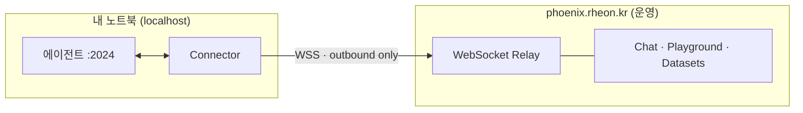
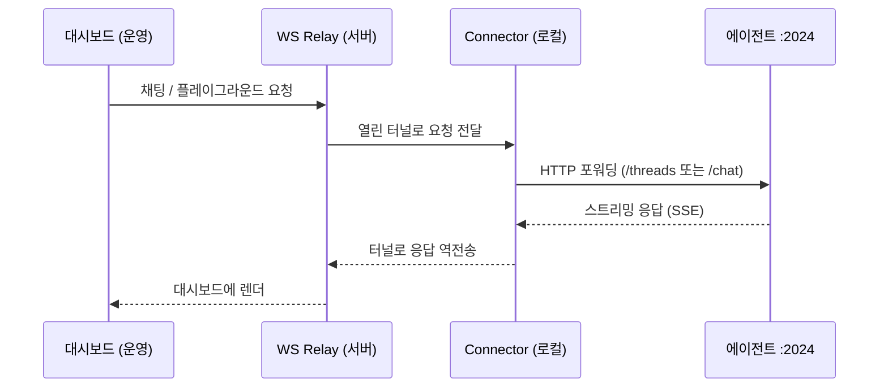
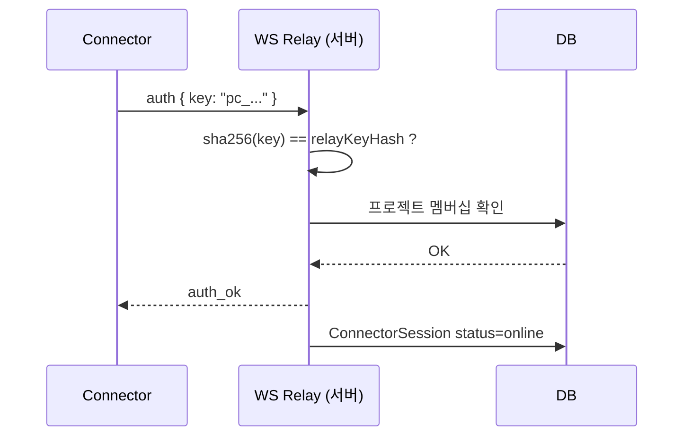

# 로컬 에이전트를 배포 없이 운영 서비스에 연결하기 — Phoenix Connector 설계

## 배경과 문제

Phoenix는 LLM 에이전트의 트레이스와 평가를 보는 관측 대시보드다. 개발 중에는 보통 에이전트를 로컬에서 띄워 둔다. 예를 들어 `langgraph dev --port 2024`로 실행한 에이전트가 `localhost:2024`에서 HTTP를 서빙하는 식이다.

여기서 필요했던 것은, 이 **배포하지 않은 로컬 에이전트**를 이미 **배포되어 있는** Phoenix 대시보드에서 그대로 사용하는 것이었다. 구체적으로는 대시보드의 채팅, 플레이그라운드, 데이터셋 테스트 같은 **인터랙티브 기능**을 로컬 에이전트에 대고 쓰고 싶었다. 코드를 고칠 때마다 에이전트를 어딘가에 배포하고 엔드포인트를 공개하는 과정 없이.

먼저 짚어둘 점이 하나 있다. **트레이싱은 이 문제와 무관하다.** 에이전트가 내보내는 트레이스는 Connector 없이도 운영 Phoenix로 전송된다. 트레이스 전송은 에이전트에서 수집 엔드포인트로 향하는 단방향 아웃바운드라 특별한 장치가 필요 없기 때문이다. Connector가 푸는 것은 그 반대 방향의 문제, 즉 **대시보드가 로컬 에이전트를 호출해야 하는** 인터랙티브 기능이다.

문제의 본질은 연결 방향이다. 로컬 에이전트는 공개 URL이 없고, 인바운드 연결도 받지 않으며, 대개 NAT나 방화벽 뒤에 있다. 따라서 운영 대시보드가 사용자의 로컬 머신으로 직접 접속할 방법이 없다. 흔한 해법은 두 가지다.

- 에이전트를 매번 배포하고 공개 엔드포인트를 연다 — 우리가 피하려던 바로 그 작업이다.
- ngrok 같은 터널링으로 로컬 포트를 외부에 노출한다 — 매번 URL을 바꿔 끼워야 하고, 인증·프로젝트 매핑을 따로 붙여야 한다.

대신 택한 방향은, 연결을 **에이전트 쪽에서 바깥으로** 맺는 것이다. 로컬에서 운영 서버로 나가는 연결을 하나 열어 두고, 그 위로 양방향 트래픽을 주고받는다. 이렇게 하면 인바운드를 열 필요가 없고, 공개 URL도 필요 없다. 이 아이디어를 구현한 것이 **Connector**다.

## Connector 아키텍처

### 역방향 WebSocket 터널

Connector는 로컬 머신과 운영 플랫폼 사이에 **역방향 WebSocket 터널**을 만든다. "역방향"이라고 부르는 이유는, 연결을 맺는 주체가 서버가 아니라 클라이언트(로컬)이기 때문이다. 연결은 항상 로컬에서 운영으로, 아웃바운드 한 방향으로만 시작된다. 에이전트는 `localhost`에 그대로 머무르고, 외부로 포트를 열지 않는다.



전송 계층으로 WebSocket을 고른 이유는 명확하다. 대시보드의 인터랙티브 기능은 요청 한 번에 응답 한 번으로 끝나지 않고, 토큰 스트림처럼 양방향으로 데이터가 오간다. WebSocket은 한 번 맺은 연결 위에서 서버와 클라이언트가 자유롭게 메시지를 주고받을 수 있고, 표준 HTTPS 포트(443) 위의 아웃바운드 연결로 동작하므로 방화벽 환경에서도 잘 통과한다. 연결을 맺는 방향(로컬 → 운영)과 트래픽이 흐르는 방향(양방향)이 분리된다는 점이 핵심이다.

### 요청 한 번이 흐르는 경로

사용자가 대시보드에서 채팅 메시지를 보내면, 그 요청은 다음 경로로 흐른다.



대시보드는 에이전트가 어디서 도는지 알 필요가 없다. 대시보드 입장에서는 Relay에 요청을 보내면 응답이 돌아올 뿐이다. Relay는 어떤 Connector가 어떤 프로젝트에 연결되어 있는지를 알고 있어서, 들어온 요청을 올바른 터널로 흘려보낸다. Connector는 그 요청을 로컬 에이전트의 HTTP 엔드포인트로 옮기고, 에이전트가 내놓는 스트리밍 응답을 다시 터널을 통해 Relay로, Relay에서 대시보드로 거슬러 보낸다. 에이전트가 클라우드에 있든 사용자의 노트북에 있든 대시보드 코드는 동일하게 동작하고, 그 차이를 Connector가 흡수한다.

### 인증과 세션

아무 로컬 프로세스나 운영 Relay에 붙을 수는 없다. Connector는 `pc_`로 시작하는 개인 키를 들고 접속한다. 인증 절차는 다음과 같다.



서버는 전달받은 키를 원문 그대로 저장하지 않는다. sha256으로 해시한 값을 사용자 레코드의 `relayKeyHash`와 비교하고, 그 사용자가 요청한 프로젝트의 멤버인지까지 확인한 뒤에야 터널을 연다. 연결이 성립하면 서버의 `ConnectorSession` 레코드에 `status=online`으로 기록되므로, 어떤 사용자가 어떤 프로젝트에 자신의 로컬 에이전트를 연결해 두었는지를 서버 쪽에서 그대로 추적할 수 있다. 키는 팀원마다 개별 발급된다.

### 에이전트 타입에 따른 포워딩

터널과 인증은 공통이지만, 마지막 한 홉 — Connector가 로컬 에이전트의 어느 HTTP 엔드포인트를 호출하느냐 — 은 에이전트 타입에 따라 달라진다. Connector는 두 가지 타입을 지원한다.

- **langgraph** (기본값): LangGraph SDK의 HTTP API를 호출한다. 스레드를 만들고(`POST /threads`) 실행을 스트리밍으로 받는다(`POST /threads/{id}/runs/stream`). `langgraph dev`로 띄운 에이전트에 맞는다.
- **rest**: `/chat` 엔드포인트 하나만 가진 커스텀 에이전트용이다. `POST /chat`에 `{messages, thread_id}`를 보내고 SSE(Server-Sent Events) 스트림으로 응답을 받는다.

즉 Relay에서 받은 동일한 요청이라도, Connector는 타입 설정에 따라 LangGraph 프로토콜로 변환하거나 단순 `/chat` 호출로 변환해서 로컬 에이전트에 전달한다.

## 에이전트는 어떤 모습이어야 하나

Connector에 연결하려면 에이전트가 위 두 인터페이스 중 하나를 따르면 된다. 실제로는 아주 단순하다.

**LangGraph 에이전트** — `langgraph dev`로 띄우면 위의 표준 엔드포인트가 자동으로 제공된다.

```python
# agent.py
from langgraph.graph import StateGraph, MessagesState, START, END
from langchain_openai import ChatOpenAI

llm = ChatOpenAI(model="gpt-4o")

def call_model(state: MessagesState):
    response = llm.invoke(state["messages"])
    return {"messages": [response]}

graph = StateGraph(MessagesState)
graph.add_node("model", call_model)
graph.add_edge(START, "model")
graph.add_edge("model", END)
agent = graph.compile()
```

```bash
langgraph dev --port 2024
phoenix-connector --key=pc_... --agent=http://localhost:2024
```

**REST 에이전트** — `/chat` 하나만 SSE로 구현하면 된다. 프레임워크에 구애받지 않는다.

```python
# rest_agent.py
from fastapi import FastAPI, Request
from fastapi.responses import StreamingResponse
from openai import OpenAI
import json

app = FastAPI()
client = OpenAI()

@app.post("/chat")
async def chat(request: Request):
    body = await request.json()
    messages = body.get("messages", [])

    def generate():
        stream = client.chat.completions.create(
            model="gpt-4o",
            messages=messages,
            stream=True,
        )
        for chunk in stream:
            delta = chunk.choices[0].delta.content or ""
            if delta:
                yield f"data: {json.dumps({'content': delta})}\n\n"
        yield "data: [DONE]\n\n"

    return StreamingResponse(generate(), media_type="text/event-stream")
```

```bash
uvicorn rest_agent:app --port 2024
phoenix-connector --key=pc_... --agent=http://localhost:2024 --type=rest
```

## 설치와 실행

Connector는 CLI 도구이므로 PyPI 패키지로 배포했다. 격리된 환경에 설치되는 `pipx`를 권장하고, 일반 `pip`로도 설치할 수 있다.

```bash
# CLI 도구라면 pipx 권장 (격리 설치)
pipx install phoenix-connector

# 또는 일반 pip
pip install phoenix-connector
```

이렇게 하면 "로컬 에이전트를 운영 서비스에 연결한다"가 설치 한 줄과 실행 한 줄로 끝난다. 사용자나 팀원은 각자 자기 에이전트를 그대로 가져와 연결할 수 있다.

### 사전 준비

1. **프로젝트 생성** — 프로젝트 페이지에서 새 프로젝트를 만든다(또는 기존 것을 사용한다).
2. **Connector 키 발급** — 전역 설정 → 프로필 & 키에서 키를 생성하고 개인 키(`pc_*`)를 복사한다. 팀원은 각자 자신의 키를 갖는다.
3. **에이전트 실행** — 에이전트가 localhost에서 HTTP를 서빙하고 있어야 한다. 예: `langgraph dev --port 2024`.

### 인터랙티브 모드

플래그 없이 실행하면 CLI가 필요한 값을 하나씩 물어본다. 처음 써 볼 때 적합하다.

```text
$ phoenix-connector

Phoenix Connector v0.1.1

  Connector key (pc_*): pc_your_key_here
  Agent URL [http://localhost:2024]:

  Agent type:
    1. langgraph
    2. rest
  Select: 1

  Assistant ID [agent]:

  Fetching projects...

  Available projects:
    1. my-project [owner]
    2. team-project [editor]
  Select project: 1
  → my-project

  Agent:   http://localhost:2024 (langgraph)
  Project: my-project

✓ Connected to SaaS
✓ Project: my-project
✓ Agent: http://localhost:2024
⏳ Waiting for requests...
```

### 플래그 모드

스크립트나 컨테이너에서는 플래그로 값을 한 번에 넘긴다.

```bash
$ phoenix-connector \
    --key=pc_your_key_here \
    --agent=http://localhost:2024 \
    --type=langgraph \
    --project=my-project-slug
```

모든 플래그는 선택이며, 빠진 값은 CLI가 인터랙티브하게 묻는다.

| 플래그 | 설명 | 기본값 |
|---|---|---|
| `--key` | Connector 키 (`pc_*`) | 프롬프트 |
| `--agent` | 로컬 에이전트 URL | `localhost:2024` |
| `--project` | 프로젝트 슬러그 (생략 시 목록에서 선택) | 선택 |
| `--type` | 에이전트 타입 (`langgraph` \| `rest`) | `langgraph` |
| `--assistant-id` | LangGraph 어시스턴트 ID | `agent` |
| `--saas-url` | 플랫폼 WebSocket URL | `wss://phoenix.rheon.kr` |

## 구현 중 부딪힌 것

아키텍처 자체는 단순하지만, 터널이 실제로 트래픽을 나르기까지 몇 가지 문제를 거쳤다. 연결 메커니즘과 직접 관련된 두 가지를 정리한다.

### Cloudflare가 막은 WebSocket 업그레이드

첫 연결부터 핸드셰이크 단계에서 한참 매달리다 `Cloudflare 524`(타임아웃)로 끊겼다. 일반 HTTP 요청은 정상인데 WebSocket 업그레이드만 실패했다. 원인은 운영 도메인 앞단의 Cloudflare 프록시였다. 짧은 요청-응답은 통과시키지만, 계속 열려 있어야 하는 long-lived WebSocket 업그레이드를 제대로 통과시키지 못하고 있었다. 프록시를 우회해 브리지 네트워크에서 대시보드 컨테이너에 직접 연결하도록 바꾸자 해결됐다. 교훈은 분명하다 — HTTP가 통과한다고 해서 WebSocket 업그레이드도 통과한다는 보장은 없다. 프록시나 로드밸런서를 한 단계 거친다면 업그레이드 경로는 별도로 확인해야 한다.

### 잘못된 엔드포인트로의 포워딩

터널은 열렸는데 채팅에 응답이 없었다. 에이전트가 죽은 것처럼 보였지만, 실제로는 한 번도 호출되지 않은 상태였다. Connector가 기본값인 `--type=langgraph`로 동작하면서 `/threads/{id}/runs/stream`을 호출하고 있었는데, 연결한 에이전트는 `/chat`만 가진 REST 에이전트였다. 존재하지 않는 경로를 두드렸으니 404가 나고, 대시보드에서는 그것이 "무응답"으로 보였다. `--type=rest`로 바꾸자 `/chat`으로 올바르게 포워딩됐다. 무응답이 보이면 응답하는 쪽(에이전트)을 의심하기 쉽지만, 호출하는 쪽이 틀린 엔드포인트를 두드리고 있을 수도 있다. 에이전트 타입 플래그가 존재하는 이유가 여기에 있다.

## 정리

Connector의 설계는 한 문장으로 요약된다. 운영 플랫폼이 로컬 에이전트로 들어올 수 없으니, 에이전트가 밖으로 나가는 아웃바운드 WebSocket 터널을 열고 그 위에서 양방향 트래픽을 주고받는다. 이 구조 덕분에 다음이 가능해진다.

- 로컬에서 개발 중인 에이전트를, 배포하지 않고 공개하지 않은 채로 운영 대시보드의 채팅·플레이그라운드·데이터셋 기능에 연결할 수 있다.
- 인바운드 포트를 열거나 매번 바뀌는 터널 URL을 관리할 필요가 없다.
- `pc_` 키와 프로젝트 멤버십으로 접근이 통제되고, 연결 상태가 서버에서 추적된다.
- 에이전트는 LangGraph 표준 API 또는 단순한 `/chat` SSE 엔드포인트 중 하나만 따르면 된다.

정리하면 이것은 호스팅된 플랫폼이 "사용자의 로컬 에이전트를 그대로 받아들이는(bring your own agent)" 방식을 구현한 것이다. 트레이싱처럼 단방향으로 충분한 기능은 Connector 없이 동작하고, 대시보드가 에이전트를 호출해야 하는 인터랙티브 기능만 이 터널을 사용한다. 새 에이전트를 연결할 때 필요한 것은 `pipx install phoenix-connector` 한 줄과, 키·프로젝트를 지정한 실행 한 줄뿐이다.
